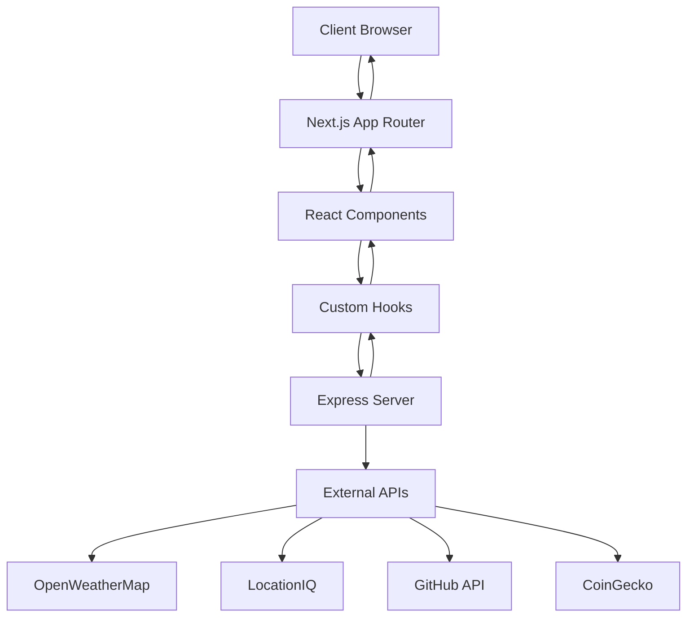

# 🏗️ Architecture du Projet

Cette section décrit l'architecture et l'organisation du code d'Open-Dash.

## 📁 Structure des Dossiers

```
open-dash/
├── 📁 docs/                    # Documentation du projet
├── 📁 public/                  # Fichiers statiques
├── 📁 server/                  # Serveur Express.js
│   └── server.mjs             # Point d'entrée du serveur
├── 📁 src/                     # Code source principal
│   ├── 📁 app/                # Pages Next.js (App Router)
│   │   ├── 📁 geography/      # Section géographie
│   │   │   ├── 📁 maps/       # Pages des cartes
│   │   │   └── 📁 weather/    # Pages météo
│   │   ├── globals.css        # Styles globaux
│   │   ├── layout.tsx         # Layout principal
│   │   └── page.tsx           # Page d'accueil
│   ├── 📁 components/         # Composants React
│   │   ├── 📁 ui/            # Composants UI de base
│   │   └── *.tsx             # Composants spécifiques
│   ├── 📁 hooks/             # Hooks React personnalisés
│   └── 📁 lib/               # Utilitaires et configuration
├── package.json               # Dépendances et scripts
├── next.config.js            # Configuration Next.js
├── tailwind.config.js        # Configuration Tailwind CSS
└── tsconfig.json             # Configuration TypeScript
```

## 🔄 Flux de Données



## 🎯 Architecture Frontend

### Next.js App Router

Le projet utilise le nouveau App Router de Next.js 15 avec les fonctionnalités suivantes :

- **Pages basées sur les fichiers** : Chaque dossier dans `app/` correspond à une route
- **Layouts imbriqués** : Réutilisation des layouts entre les pages
- **Server Components** : Rendu côté serveur par défaut
- **Client Components** : Interactivité côté client quand nécessaire

### Structure des Composants

```
components/
├── 📁 ui/                    # Composants UI réutilisables
│   ├── button.tsx           # Boutons
│   ├── card.tsx             # Cartes
│   ├── input.tsx            # Champs de saisie
│   └── ...
├── weather-card-real.tsx    # Carte météo en temps réel
├── map-card.tsx             # Carte interactive
├── location-card.tsx        # Informations de localisation
├── api-grid.tsx             # Grille des APIs
└── ...
```

### Hooks Personnalisés

```
hooks/
├── useWeather.ts           # Gestion des données météo
├── useLocation.ts          # Géolocalisation
├── useCountries.ts         # Données des pays
├── useGithub.ts           # API GitHub
├── useCrypto.ts           # Données cryptomonnaies
└── ...
```

## 🔧 Architecture Backend

### Serveur Express.js

Le serveur `server/server.mjs` gère :

- **Proxy des APIs** : Évite les problèmes CORS
- **Gestion des clés API** : Sécurisation des clés
- **Cache des données** : Optimisation des performances
- **Gestion d'erreurs** : Réponses d'erreur uniformes

### Endpoints API

```javascript
// Endpoints disponibles
GET /api/weather          // Données météo
GET /api/open-meteo       // Prévisions météo
GET /api/locationiq       // Géocodage inverse
GET /api/countries        // Informations pays
GET /api/github           // Données GitHub
GET /api/worldBank        // Données économiques
```

## 🎨 Système de Design

### Tailwind CSS 4

- **Utility-First** : Classes utilitaires pour le styling
- **Responsive Design** : Breakpoints intégrés
- **Dark Mode** : Support du thème sombre
- **Animations** : Transitions et animations fluides

### Composants UI

Basés sur Radix UI pour :
- **Accessibilité** : Conformité WCAG
- **Composants headless** : Flexibilité maximale
- **Gestion d'état** : États complexes gérés automatiquement

## 🔐 Sécurité

### Variables d'Environnement

```env
# APIs externes
OPENWEATHERMAP_API_KEY=xxx
LOCATIONIQ_KEY=xxx
GITHUB_TOKEN=xxx

# Configuration
NODE_ENV=development
```

### Bonnes Pratiques

- **Clés API côté serveur** : Jamais exposées au client
- **Validation des entrées** : Sanitisation des paramètres
- **Gestion d'erreurs** : Messages d'erreur sécurisés
- **Rate Limiting** : Protection contre les abus

## 📱 Responsive Design

### Breakpoints

```css
/* Mobile First */
sm: 640px   /* Tablettes */
md: 768px   /* Petits écrans */
lg: 1024px  /* Écrans moyens */
xl: 1280px  /* Grands écrans */
2xl: 1536px /* Très grands écrans */
```

### Stratégie Mobile-First

1. **Design mobile** en premier
2. **Amélioration progressive** pour les écrans plus grands
3. **Composants adaptatifs** selon la taille d'écran

## 🚀 Performance

### Optimisations

- **Code Splitting** : Chargement à la demande
- **Image Optimization** : Images optimisées automatiquement
- **Caching** : Cache des données API
- **Lazy Loading** : Chargement différé des composants

### Métriques

- **First Contentful Paint** : < 1.5s
- **Largest Contentful Paint** : < 2.5s
- **Cumulative Layout Shift** : < 0.1

## 🔄 État de l'Application

### Gestion d'État

- **React Context** : État global (WeatherContext)
- **Local State** : État local des composants
- **Server State** : Données des APIs

### Patterns Utilisés

- **Custom Hooks** : Logique réutilisable
- **Compound Components** : Composants composables
- **Render Props** : Partage de logique

## 📊 Monitoring

### Logs

```javascript
// Logs structurés
console.log('[Weather API]', { city, temperature, humidity });
console.error('[API Error]', { endpoint, error: error.message });
```

### Métriques

- **Temps de réponse** des APIs
- **Taux d'erreur** par endpoint
- **Utilisation des ressources** serveur

---

*Pour plus de détails sur les composants, consultez le [Guide des Composants](./composants.md)* 